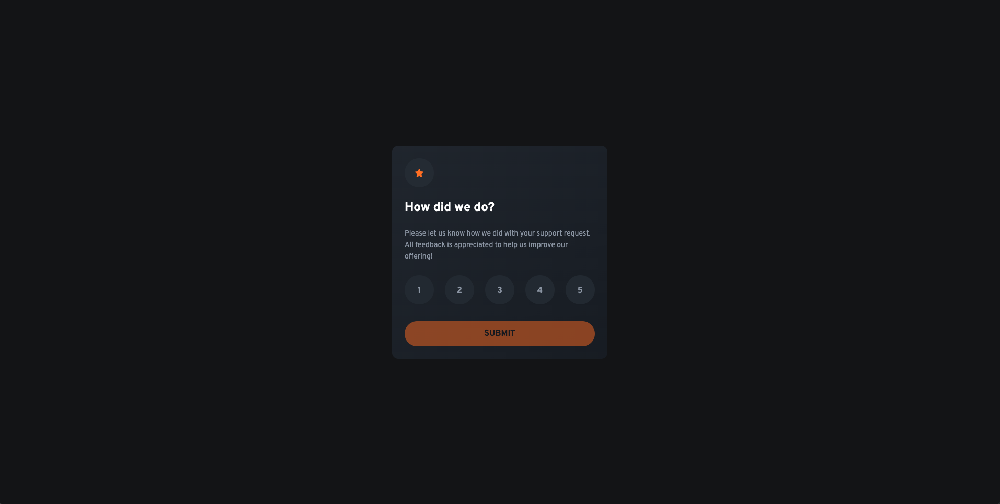

# Frontend Mentor - Interactive Rating Component solution

This is a solution to the [Interactive rating component challenge on Frontend Mentor](https://www.frontendmentor.io/challenges/interactive-rating-component-koxpeBUmI). Frontend Mentor challenges help you improve your coding skills by building realistic projects.

## Table of contents

- [Frontend Mentor - Interactive Rating Component solution](#frontend-mentor---interactive-rating-component-solution)
  - [Table of contents](#table-of-contents)
  - [Overview](#overview)
    - [The challenge](#the-challenge)
    - [Screenshot](#screenshot)
    - [Links](#links)
  - [My process](#my-process)
    - [Built with](#built-with)
    - [What I learned](#what-i-learned)
    - [Continued development](#continued-development)
  - [Author](#author)

## Overview

### The challenge

Users should be able to:

Your users should be able to:

- View the optimal layout for the app depending on their device's screen size
- See hover states for all interactive elements on the page
- Select and submit a number rating
- See the "Thank you" card state after submitting a rating

### Screenshot

### Links

- Solution URL: [GitHub](https://github.com/Chriseden83/Interactive_rating_component)
- Live Site URL: [Rating Component](https://beamish-dango-5d679e.netlify.app/)

## My process

### Built with

- React
- React State
- Tailwind CSS v4
- Mobile-first workflow

### What I learned

I enjoyed using react and getting to know the ins and outs of using state, conditional rendering. I used Tailwind CSS v4

### Continued development

More practice with React, state, Tailwind CSS, themes, animations. I need to become more profficient in laying out JSX tage for styling purposes, i'm forever re-jigging elemets. I also need to dig a bit further into theme variables when using Tailwind.

## Author

- Frontend Mentor - [@Chriseden83](https://www.frontendmentor.io/profile/@Chriseden83)
- Twitter - [@Chriseden83](https://www.twitter.com/@Chriseden83)
